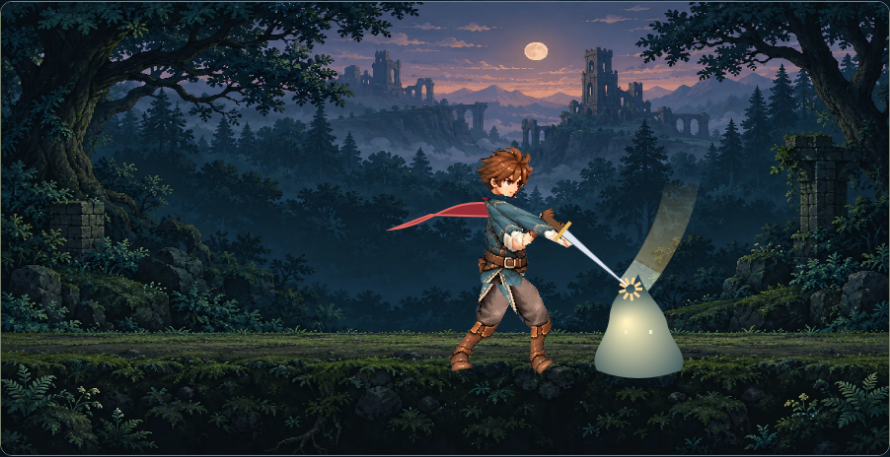

# 崩し斬りの実演

対象は剣士スキル `break`。通常攻撃の `basic` は別レンダラーのままです。
CP10、基礎倍率0.85、CD7秒、防御低下30%／5秒の戦闘仕様は維持しました。

## 実装

- `break-slash.js` が `slash-rig.js` の三次元関節・両手の握り・一本の剣を使い、振りかぶり、踏み込み、骨盤と肩の回転、斜め振り下ろし、振り抜きを連続描画します。
- 既存 `diagonal-slash.webp` から描画時に衣装・顔・腕・脚のパーツを切り出し、関節に追従させます。新しいキャラクターへの差し替えではありません。新規の手描きアニメーション素材ではなく、既存素材を用いた関節アニメーションです。
- 剣先と刀身の位置履歴から残光を作成。命中は既存の300/480時点、刀身上の接触位置に衝撃を出します。本編は実命中イベントに同期し、敵に反動・短い明滅を追加しています。
- 効果音はWeb Audioによる合成音。明示的な操作で有効化し、振り出しと命中で再生。プレビューのミスでは命中音・敵の反応・衝撃を出しません。
- `break-preview.html` は未習得でも使用可能で、セーブ／ポイントを読み書きしません。再生、一時停止、低速、コマ送り、各段階への移動、音・エフェクト・ミス切替を備えます。本編の冒険画面とスキル一覧から開けます。

## iPhoneで確認

1. この変更を配信したゲームをSafariで開く（ローカルPCの場合はリポジトリルートを `python3 -m http.server 8000 --bind 0.0.0.0` で配信し、同じWi-FiのiPhoneからPCのLANアドレス・ポート8000を開く）。クラウドの127.0.0.1にはiPhoneから接続できません。
2. 冒険画面の「崩し斬り · 動作と音の実演」を開く。または配信先の `playable/break-preview.html` を開く。
3. 通常速度で再生し、「効果音」をチェック。振り出しと接触の2音、命中時の敵の明滅・のけぞりを確認する。
4. 0.3倍速、エフェクトOFFで、足の踏み込み・腰と肩・肘・握り・刀身を確認する。「振りかぶり」「命中」「振り抜き」とスライダーでも確認する。
5. ミスをONにし、残光は残るが命中衝撃・敵の反応・命中音が出ないことを確認。横向きでも操作し、他アプリへ移動すると再生が停止することを確認する。
6. 本編では町で育成→崩し斬りを1ポイントで習得→枠へ配置→冒険へ戻って再生。こちらは本来の習得・セーブ変更を伴います。実演ページだけなら進行は変わりません。

## 検証結果と未確認

- `node --test playable/src/*.test.cjs`: 28件成功。新たに専用スキルと通常攻撃の分離、命中時刻・刀身接触位置、関節の連続性・踏み込み・回転を検証。
- Chromiumのモバイル相当390×844／844×390でページ実行、操作、横はみ出しなし、JavaScriptエラーなしを確認。
- プレビュー通常再生の振り出し／命中の音イベント、ミス時の振り出しだけ、コマ送りで追加音なしを確認。AudioContext有効化も確認。音の聞こえ方は自動テストでは評価していません。
- 本編ブラウザでも町で崩し斬りを習得し、行動枠に配置して戦闘開始・専用動作の実行を確認。
- 既存の旧版テストには不足ファイル `restored/revised_loot.cjs` と `restored/journey_v2.cjs` による既知の失敗があり、この変更では修正していません。
- iPhone実機／Safari、端末スピーカーでの音量・遅延、低性能端末のフレームレート、専門家による人体動作評価は未確認。関節に合わせた素材の変形・継ぎ目は実機での品質確認が必要です。
- GitHubへのpush、Pagesへの配信は実行していません。上記のiPhone手順にはこの変更の配信が必要です。
